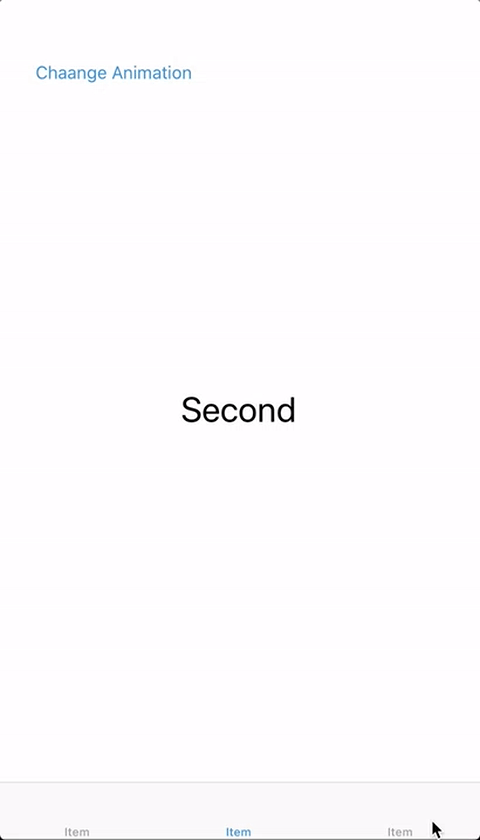
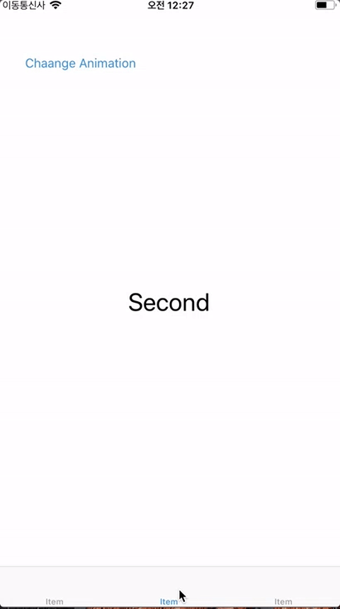
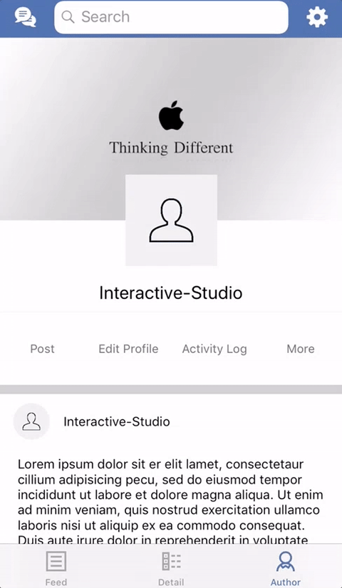
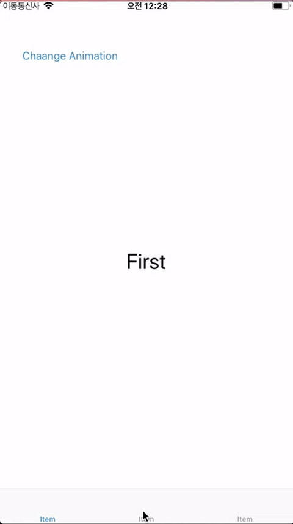

# TransitionableTab

[](https://github.com/Carthage/Carthage)
[](http://cocoapods.org/pods/Hero)


[](https://github.com/lkzhao/Hero/blob/master/LICENSE?raw=true)

**TransitionableTab** makes it easy to animate when switching between tab .

<table>
<tr>
<td width="25%">
<center>Move</center>
</td>
<td width="25%">
<center>Scale</center>
</td>
<td width="25%">
<center>Fade</center>
</td>
<td width="25%">
<center>Custom</center>
</td>
</tr>
<tr>
<td width="25%">
</img>
</td>
<td width="25%">
</img>
</td>
<td width="25%">
</img>
</td>
<td width="25%">
</img>
</td>
</tr>
</table>

## Contents

- [Requirements](#requirements)
- [Installation](#installation)
- [Usage](#usage)
- [Credits](#credits)
- [License](#license)

## Requirements

- iOS 8.0+
- Xcode 9.0+
- Swift 4.0+

## Installation

### CocoaPods

[CocoaPods](http://cocoapods.org) is a dependency manager for Cocoa projects. You can install it with the following command:

```bash
$ gem install cocoapods
```

> CocoaPods 1.1+ is required to build TransitionableTab 4.0+.

To integrate TransitionableTab into your Xcode project using CocoaPods, specify it in your `Podfile`:

```ruby
source 'https://github.com/CocoaPods/Specs.git'
platform :ios, '8.0'
use_frameworks!

target '<Your Target Name>' do
    pod 'TransitionableTab', '~> 0.1.0'
end
```

Then, run the following command:

```bash
$ pod install
```

### Carthage

[Carthage](https://github.com/Carthage/Carthage) is a decentralized dependency manager that builds your dependencies and provides you with binary frameworks.

You can install Carthage with [Homebrew](http://brew.sh/) using the following command:

```bash
$ brew update
$ brew install carthage
```

To integrate TransitionableTab into your Xcode project using Carthage, specify it in your `Cartfile`:

```ogdl
github "Interactive-Studio/TransitionableTab" ~> 0.1.0
```

Run `carthage update` to build the framework and drag the built `TransitionableTab.framework` into your Xcode project.

### Manually

If you prefer not to use either of the aforementioned dependency managers, you can integrate TransitionableTab into your project manually.

---

## Usage

The usage of **TransitioningTabBar** is very simple

```swift
import TransitionableTab

class TabBarController: UITabBarController {

    override func viewDidLoad() {
        super.viewDidLoad()
        self.delegate = self
    }
}

extension TabBarController: TransitioningTabBar {

    func tabBarController(_ tabBarController: UITabBarController, shouldSelect viewController: UIViewController) -> Bool {
        return animateTransition(tabBarController, shouldSelect: viewController)
    }
}
```

### Custom

```swift
public protocol TransitioningTabBar: UITabBarControllerDelegate {

    func transitionTimingFunction() -> CAMediaTimingFunction

    func transitionDuration() -> CFTimeInterval

    func fromTransitionAnimation(layer: CALayer, direction: Direction) -> CAAnimation

    func toTransitionAnimation(layer: CALayer, direction: Direction) -> CAAnimation
}
```

If you want to know more detailed usage, please refer to Example.

## Credits

- GwangBeom Park ([@gwangbeom](https://github.com/ParkGwangBeom))

## License

TransitionableTab is released under the MIT license. See LICENSE for details.

